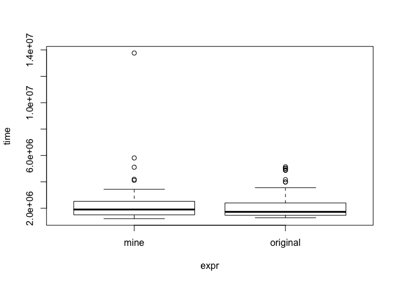

#### Prepare test


```r
textstring <- "This is a long string that needs to be Truncated. This is a long string that needs to be Truncated. This is a long string that needs to be truncated. This is a long string that needs to be truncated, and so this is a LONG STRING that needs to be truncated, and so this is a LONG STRING that needs to be truncated, and so this is a LONG STRING that needs to be TRUNCATED."
library(microbenchmark)
source("truncsmart_kearney.R")
source("truncsmart_orig.R")
```

#### Speed Test


```r
mb <- microbenchmark(
    "mine" = truncsmart(textstring, 20),
    "original" = truncsmart_og(textstring, 20))
```


#### Results


```r
mb
```

```
## Unit: milliseconds
##      expr      min       lq     mean   median       uq      max neval
##      mine 1.210045 1.498555 2.230463 1.903755 2.525639 13.76583   100
##  original 1.277780 1.462540 2.092734 1.725662 2.401656  5.14353   100
```

```r
plot(mb)
```

<!-- -->
